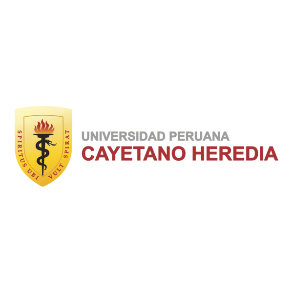
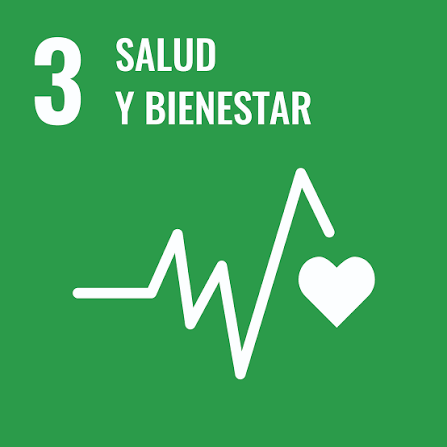
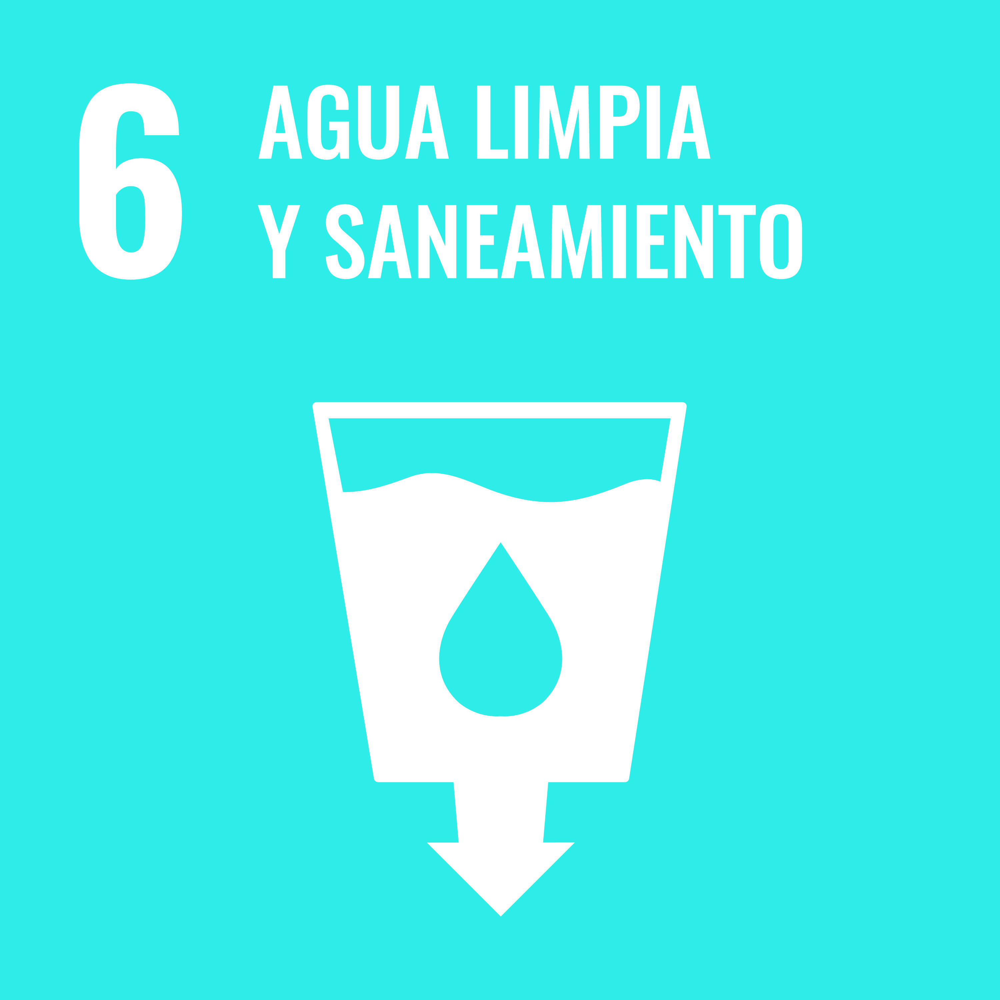
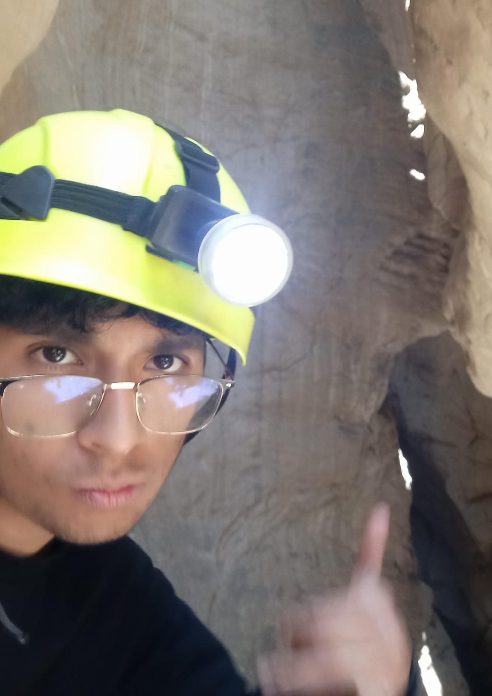
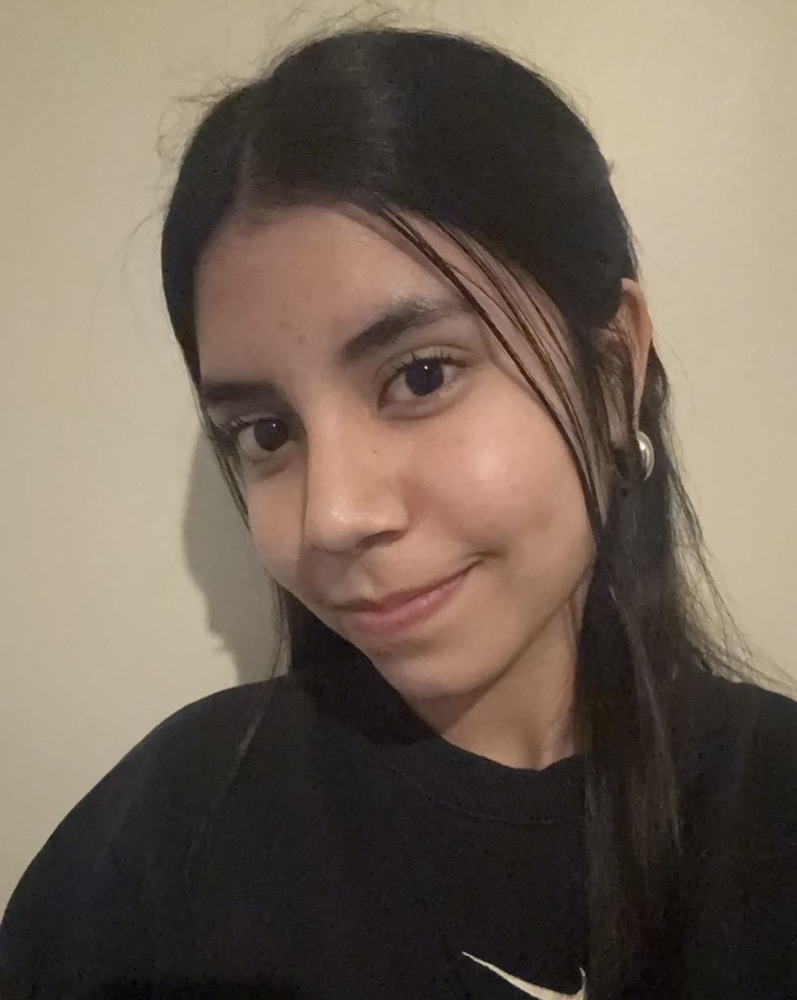
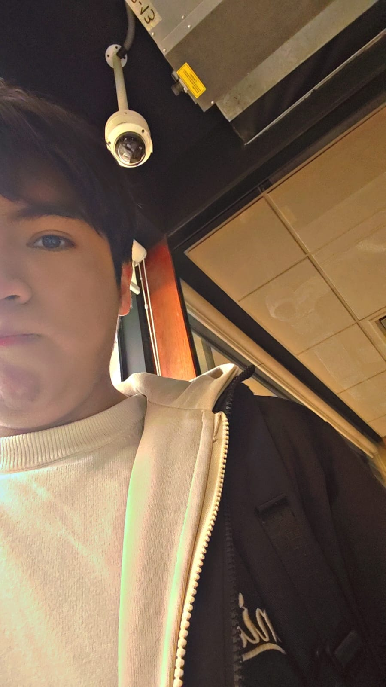
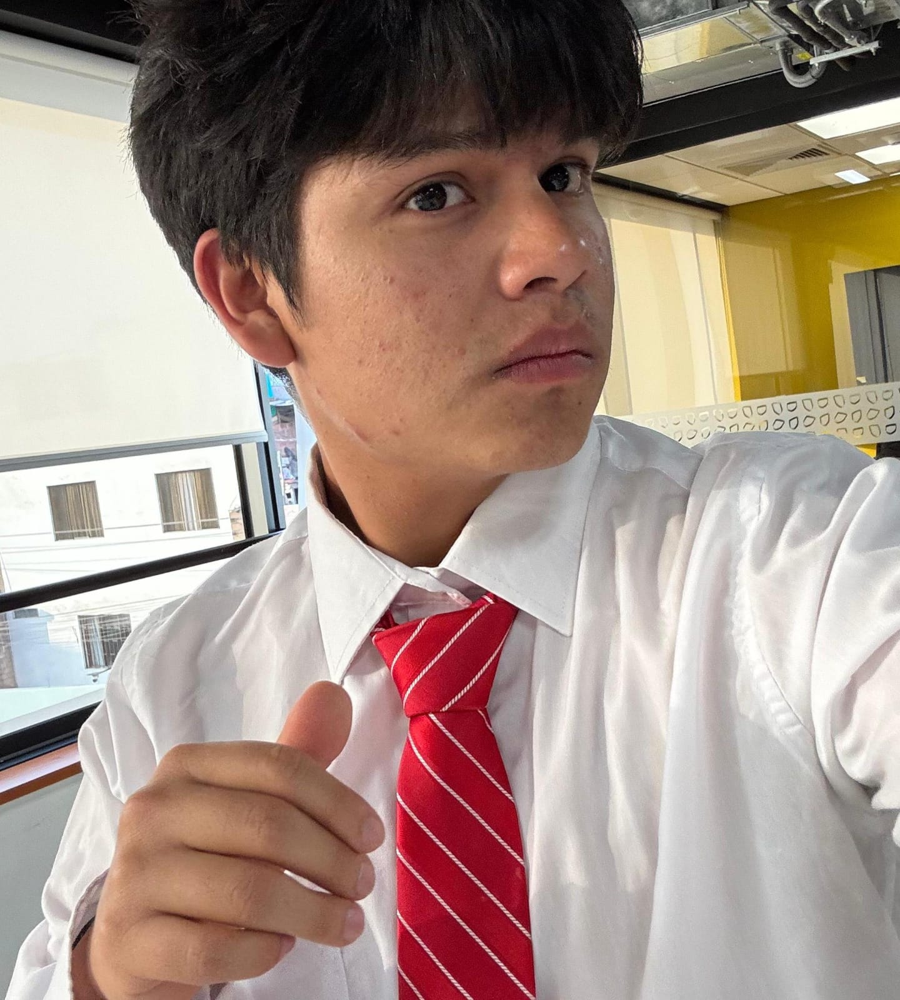

<div align="center">
  
  
  
  <br><br>

  <h1>🚀 Equipo 05 — Procesos de Innovacion Proyecto 1</h1>
  <p><b>Carreras de Ingeniería Informática e Industrial</b><br>
  <i>Universidad Peruana Cayetano Heredia (UPCH) • 2026-2</i></p>

  <p align="center">
    <a href="#"></a>
    <a href="#"></a>
    <a href="#"></a>
    <a href="#"></a>
  </p>

</div>

---

## 📋 Tabla de Contenidos
* [🌍 Descripción del Equipo y Misión](#-descripción-del-equipo-y-misión)
* [🎯 Alineación con los ODS](#-alineación-con-los-ods-agenda-2030)
* [👥 Equipo Multidisciplinario](#-equipo-multidisciplinario)
* [🔄 Metodología de Trabajo](#-metodología-de-trabajo)
* [📁 Estructura del Repositorio](#-estructura-del-repositorio)
* [🛠️ Tecnologías y Herramientas](#️-tecnologías-y-herramientas)
* [📬 Contacto e Institución](#-contacto-e-institución)
* [✨ Contribuidores](#-contribuidores)

---

## 🌍 Descripción del Equipo y Misión

> 💡 **Misión del Proyecto:** Aplicar la metodología de diseño en ingeniería para concebir soluciones tecnológicas innovadoras, accesibles y con un alto impacto social, ambiental y comunitario.

Somos el **Equipo 05** del curso *Proyectos de Ingeniería 1 (2026-1)* de la **Universidad Peruana Cayetano Heredia**. Nuestro equipo integra estudiantes de las ramas de **Ingeniería Informática, Ambiental e Industrial**, lo que nos permite abordar los retos de diseño desde el rigor del software, la sensibilidad ambiental y la optimización de recursos.

---

## 🎯 Alineación con los ODS (Agenda 2030)

Nuestro proyecto se alinea estratégicamente con los Objetivos de Desarrollo Sostenible de la ONU:

| ODS | Meta Clave | Aplicación en el Proyecto | Impacto Visual |
| :---: | :--- | :--- | :---: |
|  | **Meta 3.9:** Reducir muertes y enfermedades causadas por agua contaminada y químicos peligrosos. | Sistema de diagnóstico preventivo en tiempo real que alerta al usuario de riesgos de consumo. | 🩺 **Salud Preventiva** |
|  | **Meta 6.1:** Lograr el acceso universal y equitativo al agua potable a un precio asequible. | Democratización del monitoreo hídrico mediante hardware de bajo costo para comunidades. | 💧 **Agua Limpia** |

---
## 👥 Equipo Multidisciplinario

💡 **Enfoque colaborativo:** *Combinamos nuestras habilidades para crear soluciones tecnológicas con rigor científico y sensibilidad social.*

| Foto | Nombre | Rol Principal | Responsabilidades Clave |
| :---: | :--- | :--- | :--- |
|  | **Anderson Palomino** | 🎯 Investigación / CTO | Control de calidad, Gestión de proyectos, Inteligencia Artificial. |
|  | **Jordy Martel** | 🔬 Lider/Responsable de Inv. | Comunicación científica, Redacción técnica, Desarrollo web |
|  | **Ivana Flores** | 🎨 Diseñador UX/UI | Prototipado, experiencia de usuario |
|  | **Luis Jara Mariño** | 📄 Documentación | Redacción de informes, gestión |
|  | **Alberto Diaz ** | ⚙️ Soporte y Operaciones | Creatividad aplicada, trabajo colaborativo |

---

## 🔄 Metodología de Trabajo

Aplicamos el marco de **Design Thinking** a lo largo de las siguientes etapas:

- [x] **1. Empatizar:** Levantamiento de necesidades en el usuario y contexto ambiental.
- [x] **2. Definir:** Delimitación del problema central y requerimientos técnicos.
- [x] **3. Idear:** Propuestas de solución de hardware y software multiparamétrico.
- [ ] **4. Prototipar (En curso):** Ensamble del primer prototipo físico y plataforma de datos.
- [ ] **5. Testear:** Pruebas experimentales y validación con usuarios.

---

## 📁 Estructura del Repositorio

Para facilitar la navegación y el control de versiones, el proyecto está organizado así:

```text
📁 PI_Equipo05/
│
├── 📁 Documentación/           # Informes técnicos, entregables y matriz de diseño
├── 📁 Hardware/                # Diagramas circuitales, esquemáticos y modelos 3D
├── 📁 Imagenes/                # Recursos gráficos, fotografías del equipo y logos
├── 📁 Software/                # Código fuente del microcontrolador, scripts y web
└── 📄 README.md                # Presentación general del proyecto
```

---

## 🛠️ Tecnologías y Herramientas

<p align="center">
  
  
  
  
  
  
</p>

---

## 📬 Contacto e Institución

* **Universidad:** [Universidad Peruana Cayetano Heredia (UPCH)](https://www.cayetano.edu.pe)
* **Curso:** Procesos de Innovación (2026-2)
* **Repositorio GitHub:** [jordymartel-hash/PI_Equipo05](https://github.com/jordymartel-hash/PI_Equipo05)

---

## ✨ Contribuidores

<p align="center">
  <a href="https://github.com/jordymartel-hash/PI_Equipo05/graphs/contributors">
    
  </a>
</p>

<p align="center">
  <sub>Desarrollado con compromiso por el <b>Equipo 05</b> • UPCH © 2026</sub>
</p>

