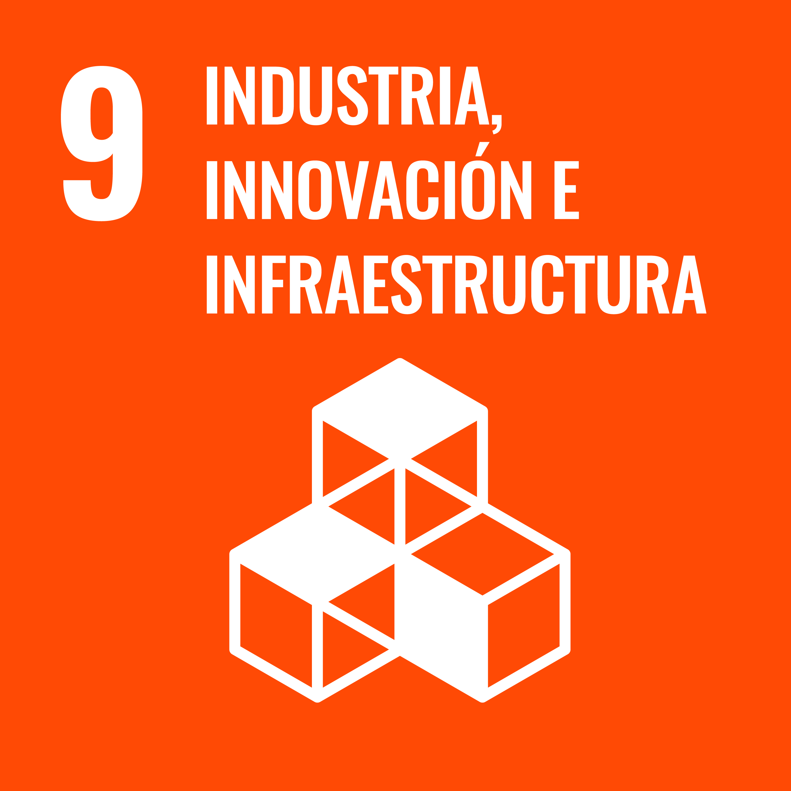
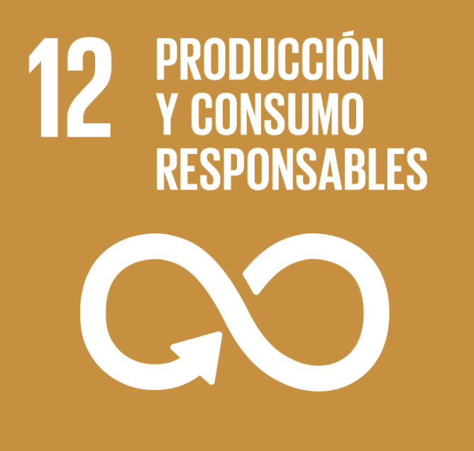
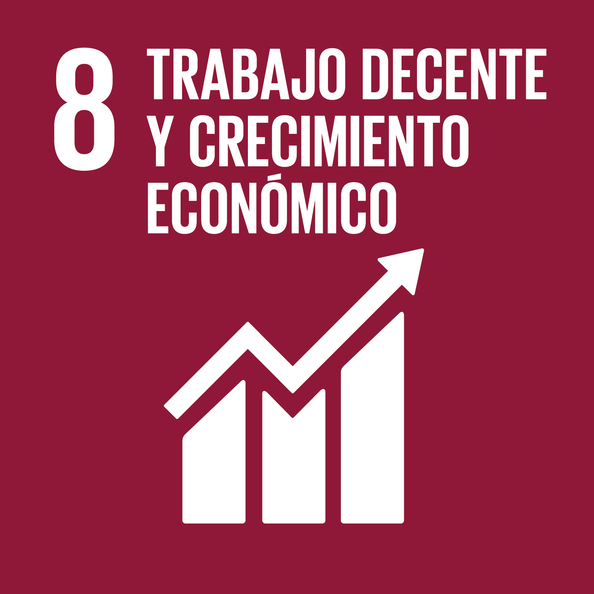
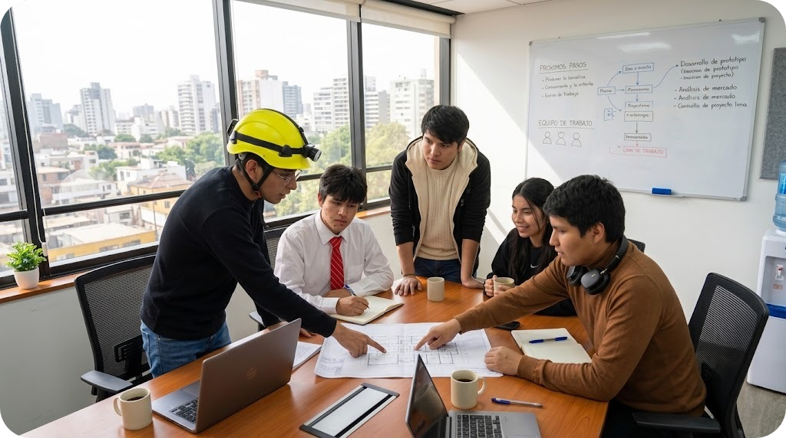

  
  
  
    

  <h1>🚀 Equipo 05 — Procesos de Innovación en Ingeniería - Proyecto 1</h1>
  
<b>Carreras de Ingeniería Informática, Ambiental e Industrial</b> 
  <i>Universidad Peruana Cayetano Heredia (UPCH) • 2026-2</i>

  

    
    
    
    
  

---

## 📋 Tabla de Contenidos
* [🌍 Descripción del Equipo y Misión](#-descripción-del-equipo-y-misión)
* [🎯 Relación con los Objetivos de Desarrollo Sostenible (ODS)](#-alineación-con-los-ods-agenda-2030)
* [👥 Equipo Multidisciplinario y Contacto](#-equipo-multidisciplinario-y-contacto)
* [🔄 Metodología de Trabajo](#-metodología-de-trabajo)
* [🛠️ Tecnologías y Herramientas](#️-tecnologías-y-herramientas)
* [📬 Institución](#-Contacto-e-Institución)
* [✨ Contributors](#-contribuidores)

---

## 🌍 Descripción del Equipo y Misión

> 💡 Nuestro Objetivo: Aplicar el análisis de datos y la optimización de procesos para resolver problemáticas de sostenibilidad, buscando identificar cuellos de botella y exceso de mermas en cadenas de suministro/logística. Mediante la recopilación y análisis de datos, propondremos una solución que optimice el uso de recursos, reduciendo el impacto ambiental y mejorando la eficiencia operativa.

**Somos el Equipo 05 del curso Procesos de Innovación en Ingeniería (2026-2) de la Universidad Peruana Cayetano Heredia. Nuestro equipo está conformado por estudiantes de Ingeniería Informática, Ambiental e Industrial, lo que nos permite abordar los retos de diseño desde diferentes campos de estudio y perspectivas de la ingeniería. Esta diversidad abre la posibilidad de integrar el desarrollo tecnológico y de software, la gestión y sostenibilidad ambiental, la optimización de procesos y recursos, logrando un enfoque multidisciplinario para desarrollar soluciones innovadoras, eficientes, orientadas a las necesidades reales de la sociedad y la comunidad.**
---

## 🎯 Relación con los Objetivos de Desarrollo Sostenible (ODS)

Nuestra solución tecnológica busca transformar grandes volúmenes de datos en información estratégica, impactando directamente en los siguientes ODS:

| ODS | Meta Clave | Aplicación y Enfoque del Proyecto |
| :---: | :--- | :--- |
|  | **ODS 9: Industria, Innovación e Infraestructura** | Optimización de procesos logísticos y modernización de infraestructura mediante el uso de tecnología y datos. |
|  | **ODS 12: Producción y Consumo Responsables** | Análisis de datos operativos para la reducción sistemática de mermas, desperdicios y uso ineficiente de recursos. |
|  | **ODS 8: Trabajo Decente y Crecimiento Económico** | Mejora de la productividad mediante la toma de decisiones basada en evidencia (*Data-driven*) y automatización. |

*(Nota: Asegúrate de tener las imágenes ODS9.jpg, ODS12.jpg y ODS8.jpg en tu carpeta "Imagenes" para que se visualicen correctamente).*

---

## 👥 Equipo Multidisciplinario y Contacto

| Foto | Nombre | Rol Principal | Responsabilidades Clave | Correo Institucional |
| :---: | :--- | :---: | :--- | :--- |
|  | **Albert Mauricio Diaz Silvera** | 📄Entrevistas y User Personas | Redacción científica y validación de entregables. | `albert.diaz@upch.pe` |
|  | **Anderson Alonso Palomino** | 📊 Analista de Datos y Logística | Estructuración de la información, evaluación de viabilidad y optimización de procesos.| `anderson.palomino@upch.pe` |
|  | **Luis Gerardo Jara Mariño** | ⚙️ Diseñador de Hardware | Gestión de componentes físicos y redacción técnica de informes. | `luis.jara.m@upch.pe` |
|  | **Ivana Patricia Flores Ayala** | 🔬 Investigación y Evaluación | Mapeo de usuarios y diseño de la experiencia interactiva. | `ivana.flores@upch.pe` |
|  | **Martel Vásquez Jordy Joel** | 🔌 Desarrollador IoT y 👑 Líder | Programación de hardware e integración de sistemas tecnológicos. | `jordy.martel@upch.pe` |

---

## 🔄 Metodología de Trabajo

Aplicamos las fases iterativas de **Design Thinking** para estructurar nuestra solución tecnológica:
- [ ] **1. Empatizar:** Levantamiento de datos cualitativos (*Desk Research* y entrevistas) para comprender el ecosistema del usuario y sus cuellos de botella logísticos.
- [ ] **2. Definir:** Procesamiento de *Insights* y delimitación del problema central basándonos en evidencia.
- [ ] **3. Idear:** Generación de alternativas que crucen la viabilidad operativa con la eficiencia de recursos.
- [ ] **4. Prototipar (En curso):** Ensamble del MVP (Producto Mínimo Viable) y estructuración de la base de datos central.
- [ ] **5. Evaluar:** Pruebas piloto para medir la precisión de los datos recolectados y el impacto en la reducción de mermas.

---

## 📊 Estado Actual del Proyecto

| Componente | Estado |
| :--- | :---: |
| Investigación y minería de datos preliminar | 🔄 En curso |
| Identificación de ineficiencias logísticas | 🔄 En curso |
| Definición del problema (*Insights*) | 🔄 En curso |
| Diseño del modelo de datos e infraestructura | 🔄 En curso |
| Desarrollo de hardware (IoT) | 🔄 En curso |
| Pruebas de rendimiento y validación | ⏳ Pendiente |

---

## 🛠️ Tecnologías y Herramientas

  
  
  
  
  
  

---

## 📬 Institución y Contacto

* **Universidad:** [Universidad Peruana Cayetano Heredia (UPCH)](https://www.cayetano.edu.pe)
* **Curso:** Procesos de Innovación en Ingeniería (C1621)
* **Repositorio GitHub:** [jordymartel-hash/PI_Equipo05](https://github.com/jordymartel-hash/PI_Equipo05)
* **Coordinador del curso:** UMBERT LEWIS DE LA CRUZ RODRIGUEZ 👨‍🏫
* **Docente Adjunta:** CLAUDIA ESTEFANIA DEJO PRADO 👩‍🏫

---

## ✨ Contribuidores

  

  

<i>Figura 1. Fotografía del equipo 05</i>

  Desarrollado con compromiso por el <b>Equipo 05</b> • UPCH © 2026

